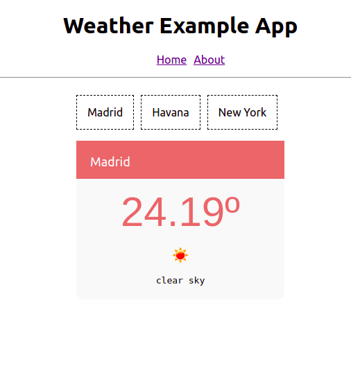

# A React Redux Observable Weather example app 🔥
[](https://opensource.org/licenses/MIT)

### [Live demo](http://weather.apps.juliocesar.space/)  

## Setup in local
You need at least node v8.x.  
This project was created with [create-react-app](https://github.com/facebook/create-react-app). 

- Clone this repo: `$ git clone https://github.com/juliomatcom/react-redux-observable-app-weather.git`  

- `$ npm install`  

- In order to show real time data you need a free API key from https://openweathermap.org/api then add a new `api.json` file in the `src/` folder with the content:  

  ```json
  {
    "id": "<YOUR_API_KEY>"
  }
  ```
- Run in localhost (development mode):  
  `$ npm start`  

- Run tests:  
  `$ npm test`  

Hover over a City or click on mobile to show the current weather.   



Powered by [openweathermap](https://openweathermap.org/api)
